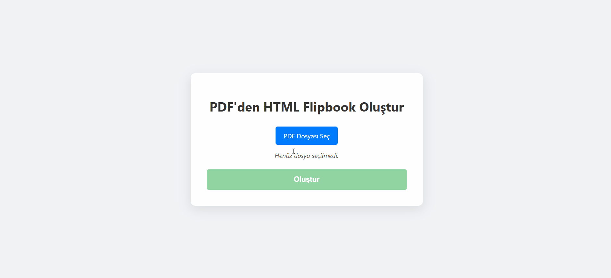

# PDF'den Etkileşimli Flipbook Oluşturucu / Interactive PDF to Flipbook Converter

Tek bir HTML dosyası ile PDF'lerinizi modern, hızlı ve etkileşimli dijital yayınlara dönüştürün.
Sunucuya veya karmaşık kütüphanelere gerek yok.
Türkçe kullanım için flipbook_maker_TR.html sayfasını indirip kulanabilirsiniz.
---
Convert your PDFs into modern, fast, and interactive digital publications with a single HTML file. 
No server or complex dependencies needed.
You can download and use the flipbook_maker_EN.html page for English usage.
---

## Flipbook Oluşturucu Hakkında / About Flipbook Creator

Bu bağımsız html sayfası, standart PDF dosyalarını, gerçek bir kitap veya dergi gibi sayfa çevirme efektine sahip, akıcı ve modern dijital flipbook'lara dönüştürmek için tasarlanmıştır. Tamamen tarayıcı üzerinde (yerel bilgisayarınızda) çalışır ve sonuç olarak her yerde paylaşılabilen, kendi kendine yeten tek bir `.html` dosyası üretir.

This standalon html page is designed to convert standard PDF files into fluid, modern digital flipbooks with a realistic page-turning effect, just like a real book or magazine. It runs entirely in the browser (locally) and produces a single, self-contained `.html` file that can be shared and viewed anywhere.

## Özellikler / Properties

- Sayfa sınırı yok. No page limit.
- İnternetsiz, yerel bilgisayarınızdan çalışır. PDF dosyalarınız güvende. Works offline, directly on your computer.Your PDF's in secure.
- Oluşturduğunuz flipbook'u html sayfası olarak indirebilirsiniz. Tekrar tekrar oluşturmanıza gerek yok. You can download the flipbook you created as an HTML page. You don't need to create it again and again.

## Kullanım Alanları / Use Cases

- Dijital Dergiler ve Kataloglar
- Eğitim Materyalleri ve E-Kitaplar
- Ürün Broşürleri ve Kılavuzlar
- Restoran Menüleri

## Nasıl Kullanılır?

1. `index.html` dosyasını tarayıcınızda açın. / Open the `index.html` file in your browser.
2. "PDF Dosyası Seç" butonuna tıklayarak bilgisayarınızdan bir PDF seçin. / Click the “Select PDF File” button and choose a PDF from your computer.
3. Dosyanın işlenmesini bekleyin ve "Flipbook Oluştur" butonuna tıklayın.
4. Flipbook'unuz yeni bir sekmede açılacaktır. Keyfini çıkarın! / Wait for the file to process and click the “Create Flipbook” button.
5. Oluşturduğunuz flipbook'u kaydetmek için alttaki "İndir" butonunu kullanabilirsiniz. / To save the flipbook you created, you can use the “Download” button below.